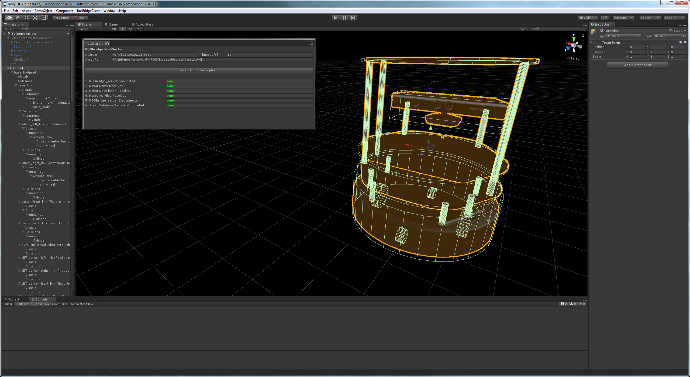
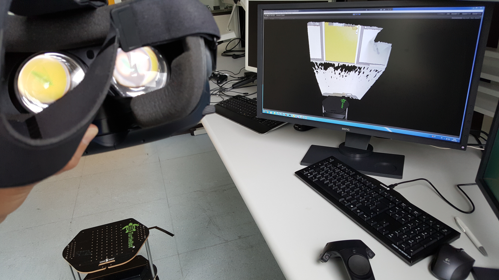
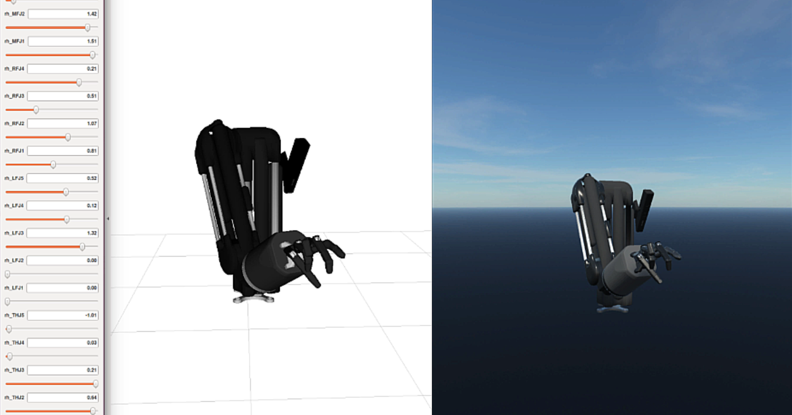
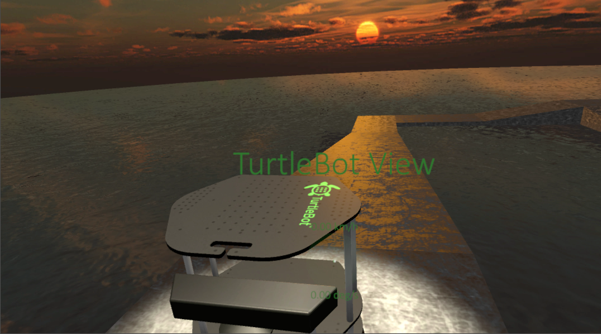

### [ROS#](https://github.com/siemens/ros-sharp) helps you to...

* **...communicate** with [ROS](http://www.ros.org/) from within your Windows Application.

	Subscribe and publish topics, call and advertise services, set and get parameters and use all features provided by [rosbridge_suite](http://wiki.ros.org/rosbridge_suite). [Here](Info_CodeExample) is a code example.

* **...import** your robot's URDF model as a Gameobject in [Unity](https://unity3d.com/) ([video](https://youtu.be/EhSbufLlvvc)\*).

	Import the data either directly from the [ROS](http://www.ros.org/) system using the robot_description service or via a URDF file that you copied into your [Unity](https://unity3d.com/) Asset folder.

    

    
    

* **...control** your real Robot via [Unity](https://unity3d.com/) ([video](https://youtu.be/OytzagQirrk)\*)

	

    
	

* **...visualize** your robot's actual state and sensor data in [Unity](https://unity3d.com/) ([video](https://youtu.be/wo3hwsPFEPY)\*). 

	

    
	

* **...simulate** your robot in [Unity](https://unity3d.com/) with the data provided by the URDF and without using a connection to [ROS](http://www.ros.org/).
	Beside visual components as meshes and textures, also joint parameters and masses, centers of mass, inertia and collider specifications of rigid bodies are imported and used for the physical simulation in [Unity](https://unity3d.com/) ([video](https://youtu.be/cjp75A_HBSs)\*).

	

    
	

* **...and much more!** [ROS#](https://github.com/siemens/ros-sharp) is useful for a wide variety of applications. Think about Machine Learning, Human-Machine Interaction, Tele-Engineering, Virtual Prototyping, Robot Fleet Operation, Gaming and Entertainment!

\* **Note**: these videos are meant only as a showcase of what is possible with ROS#. Please do not follow them as a tutorial, since they may not use the most recent version of ROS#, and/or may use custom scripts that are not included in ROS#.

---

© Siemens AG, 2017-2018
Author: Dr. Martin Bischoff (martin.bischoff@siemens.com)
