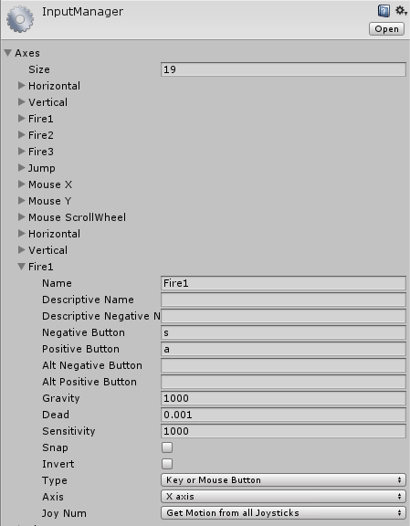
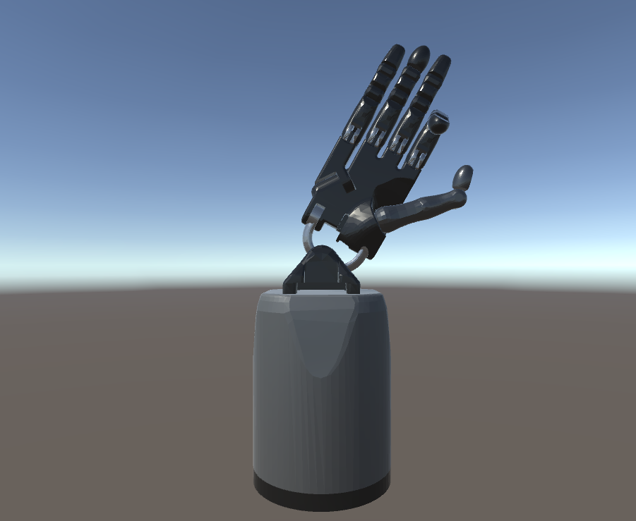

# 3.3 Animate a Robot Model in [Unity](https://unity3d.com/)
**Note:** This tutorial assumes that you have completed tutorials:
* [1.1 Unity on Windows](User_Inst_Unity3DOnWindows)
* [3.1 Import URDF on Windows](User_App_NoROS_ImportURDFOnWindows)

To move the imported robot by manipulating the joint transform, two additional scripts are required:
* `JoyAxisJointTransformWriter.cs` (`/PATH_TO_YOUR_UNITY_PROJECT/Assets/RosSharp/Scripts/MessageHandling/`)
* `JoyAxisInputPasser.cs` (`/PATH_TO_YOUR_UNITY_PROJECT/Assets/RosSharp/Scripts/MessageHandling/`)

These scripts can be used for every joint.
* Drag and drop the two scripts from the Project window to the Hierarchy window to the desired joint. (In this example the `ffmiddle (revolute Joint: FFJ2)`, `thdistal (revolute Joint: THJ1)` and `wrist (revolute Joint: WRJ2)` are used)
* In each of these joints tag `Do Apply Unity Joint Limits` and set the `Step Length` of the `Joy Axis Joint Transform Writer (Script)` for example as follows:
 * `ffmiddle (revolute Joint: FFJ2)`: `2`
 * `thdistal (revolute Joint: THJ1)`: `1`
 * `wrist (revolute Joint: WRJ2)`: `0.5`
* In each of these joints define the `Axis Name` of the `Joy Axis Input Passer (Script)` (e.g., to `Fire1`) to set the desired input controller
* In `Edit` > `Project Settings` > `Input` there is an overview of all input axes 

* After pressing play, pushing `a` and `s` respectively will move the joints  

----
© Siemens AG, 2017-2018
Author: Verena Röhrl
(verena.roehrl@siemens.com)
