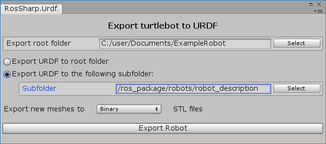

# 3.1 Create, modify and/or export a URDF robot
**Note:** This tutorial assumes that you have completed tutorials:
* [1.1 Unity on Windows](User_Inst_Unity3DOnWindows)
* [3.1 Import a URDF on Windows](User_App_NoROS_ImportURDFOnWindows)

## Create

### Build a URDF model from scratch
Watch this [tutorial video](https://youtu.be/07q2mGxD2j8) for an example of how to build a URDF robot from scratch.

### Modify an existing URDF model 
1. Import a URDF model, as outlined in [tutorial 3.1](User_App_NoROS_ImportUrdfOnWindows)
2. Make any desired changes (e.g.: change a joint axis, move a link into the correct position, etc.). For an idea of how to accomplish this, watch the tutorial video linked above.

## Export

1. Navigate to the root game object of the URDF model that you want to export. It will have a UrdfRobot script attached.
2. In the Inspector of the UrdfRobot script, click "Export Robot to URDF file."
3. In the editor window that opens, define an export location and other preferences.
4. Click "Export Robot."

**Note:** In step 3, select "Export URDF to the following subfolder" in order to make all the mesh and resource paths in the URDF file be relative to a subfolder of the export location. This is useful when publishing/visualizing the robot in ROS, especially in situations where the URDF files should not be placed directly in the ROS package root folder.

### Demonstration

A URDF model created in ROS# can be used like any other robot. Watch this [video](https://youtu.be/GZVoKfn38hU) to see an example robot being manipulated in Unity, RViZ, and Gazebo.

##### Next tutorial: [3.3 Animate a Robot Model in Unity](User_App_NoROS_AnimateRobotModelInUnity3D)

----
© Siemens AG, 2018
Author: Suzannah Smith
(suzannah.smith@siemens.com)
