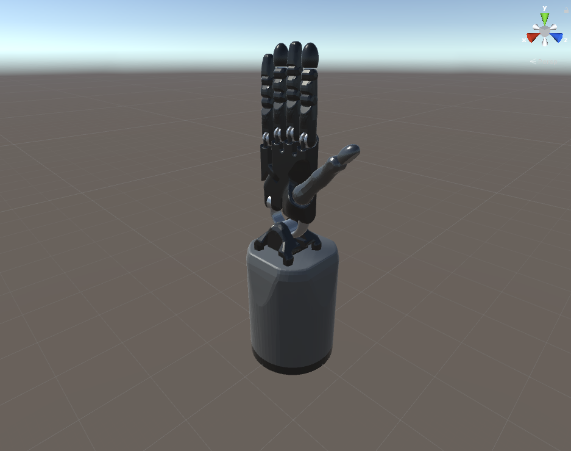

# 3.1 Import a URDF on Windows
**Note:** This tutorial assumes that you have completed tutorials:
* [1.1 Unity on Windows](User_Inst_Unity3DOnWindows)
* [1.6 Shadow Hand](User_Inst_ShadowHand)

## Copy the Model data into the Unity Asset folder

### General Approach:
1. Copy the `.urdf` file into an arbitrary Asset subfolder.
2. Copy all resources (mesh and texture files) into the same subfolder while maintaining the original folder structure of the ROS package.
3. In Unity, find the `.urdf` file in the Project window pane. Right click the file and select `Import Robot from URDF` in the context menu. (*Alternative method:* in Unity's menu bar, click `GameObject` > `3D Object` > `URDF Model (import)` and select the `.urdf` file.)

### Shadow Hand Example:
1. Copy the `shadowhand.urdf` from `simox_ros/sr_grasp_description/urdf` to:
```
/Assets/Urdf/simox_ros/shadowhand.urdf
```
2. Copy the `.dae` mesh geometry files from `simox_ros/sr_grasp_description/meshes` to:
```
/Assets/Urdf/simox_ros/sr_grasp_description/meshes
```
3. In [Unity](https://unity3d.com/) click `GameObject` > `3D Object` > `URDF Model` and select `shadowhand.urdf`.

Here is an illustration of the resulting [Shadow Hand](https://www.shadowrobot.com/products/dexterous-hand/) GameObject which is directly imported into the scene.



##### Next tutorial: [3.2 Create, Modify and Export a URDF model](User_App_NoROS_ExportURDFOnWindows)

----
© Siemens AG, 2017-2018
Author: Verena Röhrl
(verena.roehrl@siemens.com)
