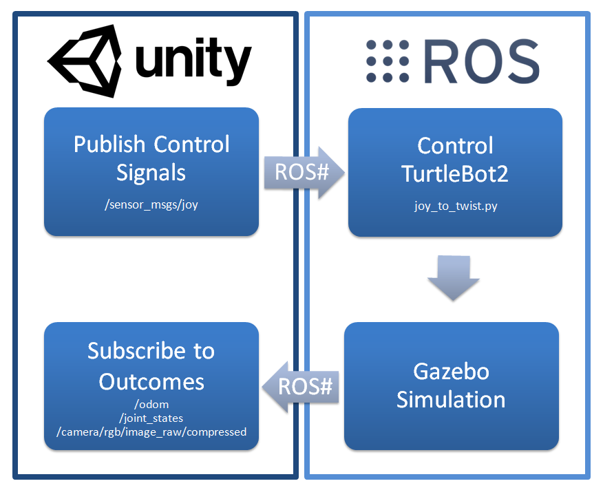
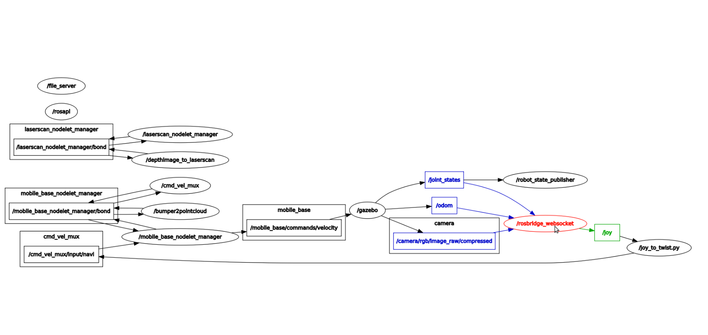
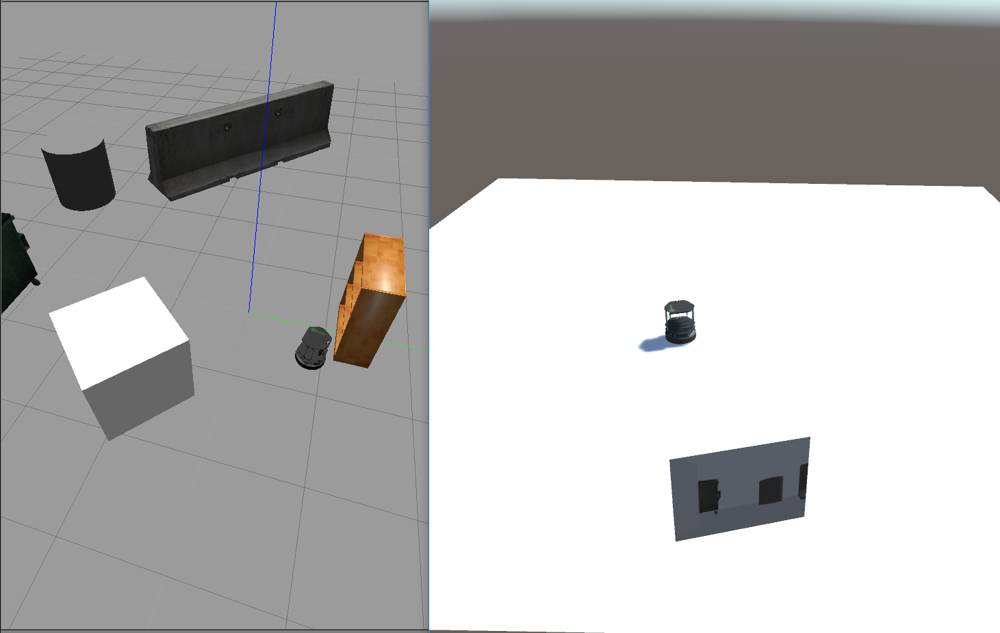

# 2.3 [Gazebo](http://gazebosim.org/) Simulation Example
**Note:** This tutorial assumes that you have completed tutorials:
* [1 - Installation and Configuration](User_Inst_InstallationAndConfiguration)
* [2.1 Import a URDF from ROS](User_App_ROS_TransferURDFFromROS)

## Overview
This application of [ROS#](https://github.com/siemens/ros-sharp) illustrates the communication between [Unity](https://unity3d.com/) and [ROS](http://www.ros.org/) in which the real time simulation takes place in [Gazebo](http://gazebosim.org/) on the [ROS](http://www.ros.org/) side. The following figure illustrates the general schema of the application.

<br />

For simplicity, an existing [Gazebo](http://gazebosim.org/) simulation is used to simulate the [TurtleBot2](http://www.turtlebot.com/turtlebot2/) on the [ROS](http://www.ros.org/) side. The control signals are sent from [Unity](https://unity3d.com/) to [ROS](http://www.ros.org/). Furthermore, the outcomes of [ROS](http://www.ros.org/) are captured by [Unity](https://unity3d.com/) for illustrative purposes.  

* Messages to be sent by [Unity](https://unity3d.com/) using [ROS#](https://github.com/siemens/ros-sharp):
	* `/sensor_msgs/joy`

* Topics to be subscribed by [Unity](https://unity3d.com/) using [ROS#](https://github.com/siemens/ros-sharp):
	* `/odom`
	* `/joint_states`
	* `/camera/rgb/image_raw/compressed`

A joystick connected to [Unity](https://unity3d.com/) controls the [TurtleBot2](http://www.turtlebot.com/turtlebot2/). Messages of the type `/sensor_msgs/joy` are sent to the `rosbridge_websocket` to be captured by [ROS](http://www.ros.org/). The existing [Gazebo](http://gazebosim.org/) simulation for [TurtleBot2](http://www.turtlebot.com/turtlebot2/) requires messages of the type `/geometry_msgs/twist` on the [ROS](http://www.ros.org/) side. Therefore, the captured `/sensor_msgs/joy` messages are converted into `/geometry_msgs/twist` messages. This is accomplished by the [ROS](http://www.ros.org/) node `joy_to_twist`.

The [Gazebo](http://gazebosim.org/) simulation publishes the topics `/odom`, `/joint_states` and `/camera/rgb/image_raw/compressed`, which are captured by [Unity](https://unity3d.com/) using `rosbridge_websocket`. Finally, the captured messages are linked to the URDF model in [Unity](https://unity3d.com/).

## Preparation
### Setting up the [Unity](https://unity3d.com/) scene
* Compose the Unity scene `GazeboSimulationScene` by following [this video](https://youtu.be/KUZt7lkc0kM).
* You can use [Assets/RosSharp/Scenes/GazeboSimulationScene.unity](https://github.com/siemens/ros-sharp/blob/master/Unity3D/Assets/RosSharp/Scenes/GazeboSimulationScene.unity) for reference. Please note that meshes and textures of the robot are not included in this Unity project. Instead please import them yourself as described in [Section 2.1](User_App_ROS_TransferURDFFromROS).

<!---
Steps taken in video to create scene:
- RosConnector
	- Add RosConnector script
	- Show which protocol to choose
	- Change IP address
	- Add Urdf Patcher, and drag turtlebot gameObject onto it. Click apply.
	- Add Joint State Subscriber (topic = /joint-states)
	- Add Joy Publisher (topic = joy, Frame Id = Unity)
	- Add Joy Axis Reader (Name = Horizontal)
	- Add Joy Axis Reader (name = Vertical)
	- Add Odometry Subscriber (topic = /odom), and drag base_link onto it
	- Add Image Subscriber (topic = /camera/rgb/image_raw/compressed)

- Turtlebot:
	- ImagePlane:
		- Add Plane to camera_rgb_frame.
		- Rename to ImagePlane.
		- Properties: Position = 0, 0, 2. Rotation = 90, 180, 0. Scale = 0.3, 1, 0.3
		- Drag onto ImageSubscriber in RosConnector
-->

## Execution
* Make sure that you have completed tutorials [1.4](User_Inst_Gazebo), [1.5](User_Inst_TurtleBot2), and [1.7](User_Inst_GazeboSimulationExample)
* Run the following command in your terminal:
```
$ roslaunch gazebo_simulation_scene gazebo_simulation_scene.launch
```
This will launch `rosbridge_websocket`, `file_server`, `joy_to_twist`, `rqt_graph` and a [Gazebo](http://gazebosim.org/) simulation of the [TurtleBot2](http://www.turtlebot.com/turtlebot2/) in the default `turtlebot_world`

As soon as all ROS nodes are launched, the robot in both simulations is ready to move.
* If desired, connect a game controller to Unity, in order to control the robot. Otherwise, use the arrow keys.
* When the `Play` button in pressed, the [ROS](http://www.ros.org/) terminal will show that a client has connected and subscribes to some topics:
```
[INFO] [1520503573.897354, 57.560000]: Client connected.  1 clients total.
[INFO] [1520503574.689767, 58.330000]: [Client 0] Subscribed to /camera/rgb/image_raw/compressed
[INFO] [1520503574.697262, 58.340000]: [Client 0] Subscribed to /joint_states
[INFO] [1520503574.736412, 58.380000]: [Client 0] Subscribed to /odom
```
* After clicking the refresh button in the `rqt_graph`, a network similar to the following figure appears:

Here you see that the topic`/sensor_msgs/joy` is published by [Unity](https://unity3d.com/), and the topics `/odom`, `/joint_states` and `/camera/rgb/image_raw/compressed` are subscribed by [Unity](https://unity3d.com/) using `rosbridge_websocket`.
* Pressing the controller buttons or the arrow keys will move the robot in [Gazebo](http://gazebosim.org/) and in [Unity](https://unity3d.com/). Furthermore, the camera image of the [TurtleBot2](http://www.turtlebot.com/turtlebot2/) in [Gazebo](http://gazebosim.org/) is projected onto a plane in [Unity](https://unity3d.com/) for illustrative purposes.


The whole process of preparation and execution can be seen in [the video](https://youtu.be/KUZt7lkc0kM) mentioned above.


##### Next tutorial: [2.4 Unity Simulation Example](User_App_ROS_UnitySimulationExample)

----
© Siemens AG, 2017-2018
Author: Verena Röhrl
(verena.roehrl@siemens.com)
