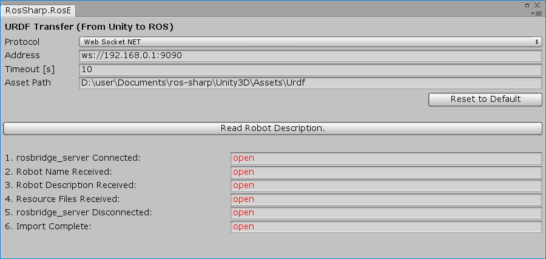
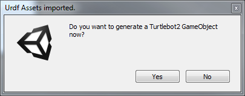
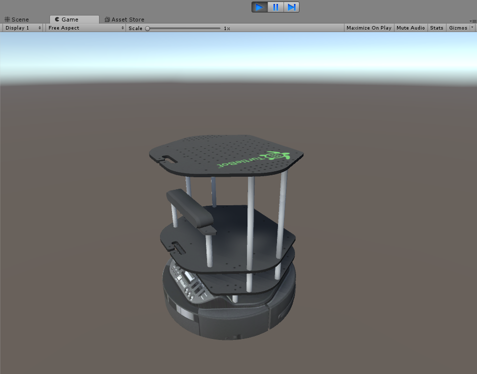

# 2.1 Transfer a URDF from [ROS](http://www.ros.org/) to Unity
**Note:** This tutorial assumes that you have completed tutorial:
[1 - Installation and Configuration](User_Inst_InstallationAndConfiguration).

### In Ubuntu VM:
* Using the following command, launch the `publish_description_TurtleBot2.launch` file which was previously downloaded in the [1.3 ROS on Ubuntu](User_Inst_ROSOnUbuntu) tutorial. This will launch `rosbridge_websocket` and `file_server`, and will publish the required `robot_description` and `robot/name` parameters to be captured by Unity.
```
$ roslaunch file_server publish_description_turtlebot2.launch
```
### In Unity:
* Go to `RosBridgeClient` > `Transfer URDF from ROS...`
* In the dialog box, change the address to the IP address of `enp0s8` mentioned earlier in [tutorial 1.2](User_Inst_UbuntuOnOracleVM)
* Change the port to `9090` as displayed in the `roslaunch` terminal. `ws://xxx.xxx.xxx.xxx:9090`<br />
<br />
* Initiate the transfer by clicking the button `Read Robot Description`.

* The following dialog box appears<br />
<br />
* Click `Yes`. This leads to a creation of a GameObject in the scene<br />
<br />


##### Next tutorial: [2.2 Transfer a URDF from Unity to ROS](User_App_ROS_TransferURDFToROS)

----
© Siemens AG, 2017-2018
Author: Verena Röhrl
(verena.roehrl@siemens.com)
