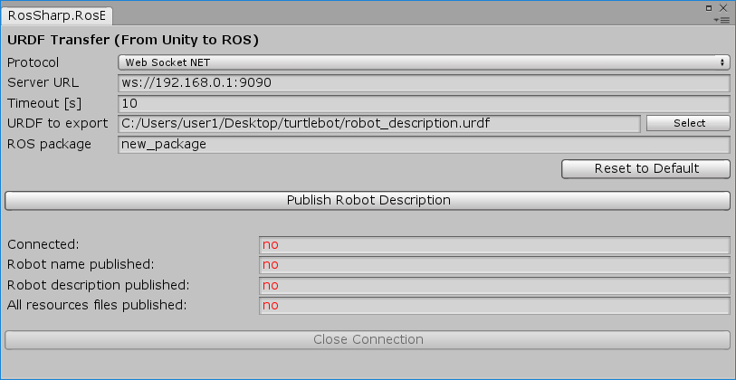
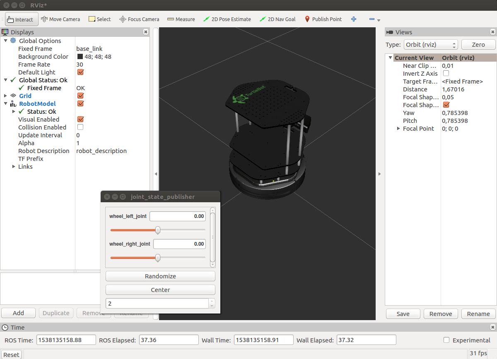

# 2.2 Transfer a URDF from Unity to [ROS](http://www.ros.org/)
**Note:** This tutorial assumes that you have completed tutorial:
[1 - Installation and Configuration](User_Inst_InstallationAndConfiguration).

### In Ubuntu VM:
* Using the following command, launch the `ros_sharp_communication.launch` file which was previously downloaded in the [1.3 ROS on Ubuntu](User_Inst_ROSOnUbuntu) tutorial. This will launch `rosbridge_websocket` and `file_server`, so that ROS is ready to receive any information sent from Unity.
```
$ roslaunch file_server ros_sharp_communication.launch
```

### In Unity:
* In Unity go to `RosBridgeClient` > `Transfer URDF to ROS...`<br />

<br />
* In the dialog box, change the address to the IP address of `enp0s8` mentioned earlier in [tutorial 1.2](User_Inst_UbuntuOnOracleVM)
* Change the port to `9090` as displayed in the `roslaunch` terminal. `ws://xxx.xxx.xxx.xxx:9090`
* Select a URDF file to export. In order to transfer meshes and texture files properly, the URDF file must be in the same root folder as the assets.
* Enter a ROS package name. The URDF file and any resources it needs will be transfered to this package. If the package doesn't already exist in your catkin workspace, a new one with this name will be created.
* Initiate the transfer by clicking the button `Read Robot Description`.

### In Ubuntu VM:
* In your catkin workspace, all URDF files will be in the package that you specified previously. As well, you can now access the rosparams `/robot_description` and `/robot_name`.
* To visualize the transfered robot, run the following command. This will launch `robot_state_publisher`, `joint_state_publisher`, and RVIZ.
 ```
$ roslaunch file_server visualize_robot.launch
```
<br />

##### Next tutorial: [2.3 Gazebo Simulation Example](User_App_ROS_GazeboSimulationExample)

----
© Siemens AG, 2018
Author: Suzannah Smith
(suzannah.smith@siemens.com)
