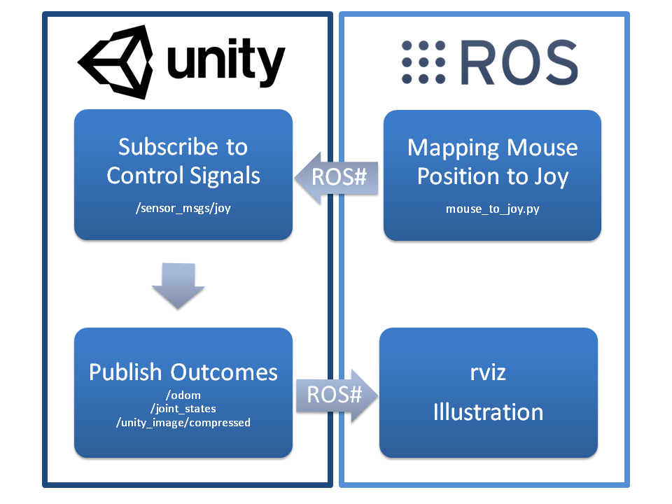
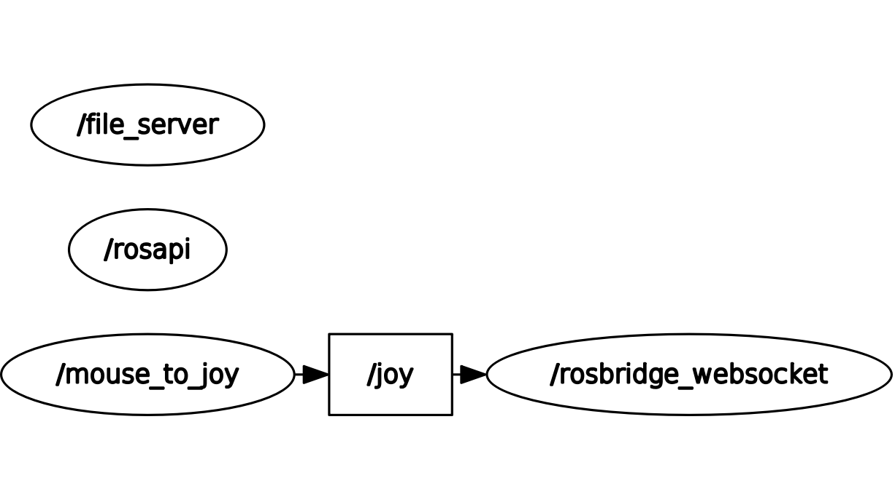
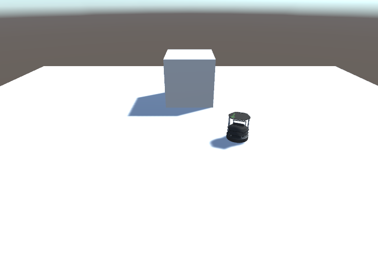

# 2.4 [Unity](https://unity3d.com/) Simulation Example
**Note:** This tutorial assumes that you have completed tutorials:
* [1 - Installation and Configuration](User_Inst_InstallationAndConfiguration)
* [2.1 Import a URDF from ROS](User_App_ROS_TransferURDFFromROS)

## Overview
This application of [ROS#](https://github.com/siemens/ros-sharp) illustrates the communication between [Unity](https://unity3d.com/) and [ROS](http://www.ros.org/) in which the real time simulation takes place in [Unity](https://unity3d.com/). The following figure illustrates the general schema of the application.

<br />

The control signals are sent from [ROS](http://www.ros.org/) to [Unity](https://unity3d.com/). Consequently, the outcomes of [Unity](https://unity3d.com/) are captured by [ROS](http://www.ros.org/) to illustrate them using [rviz](http://wiki.ros.org/rviz) as an example.

* Messages to be subscribed by [Unity](https://unity3d.com/) using [ROS#](https://github.com/siemens/ros-sharp):
 * `/sensor_msgs/joy`

* Topics to be published by [Unity](https://unity3d.com/) using [ROS#](https://github.com/siemens/ros-sharp):
 * `/odom`
 * `/joint_states`
 * `/unity_image/compressed`

The movement of the mouse cursor in Ubuntu is used to control the [TurtleBot2](http://www.turtlebot.com/turtlebot2/) in [Unity](https://unity3d.com/). Therefore, the [ROS](http://www.ros.org/) node `mouse_to_joy.py` maps the movement of the mouse cursor to messages of the type `sensor_msgs/joy`. These are sent to the `rosbridge_websocket` to be captured by [Unity](https://unity3d.com/).

In [Unity](https://unity3d.com/) the robot will move according to the captured movement of the mouse cursor in Ubuntu and the topics `/odom`, `/joint_states` and `/unity_image/compressed` are published for further processing using [ROS#](https://github.com/siemens/ros-sharp).

## Preparation
### Setting up the [Unity](https://unity3d.com/) scene

* Compose the Unity scene `UnitySimulationScene` by following [this video](https://youtu.be/sup2Tdxt1ko).
* You can use [Assets/RosSharp/Scenes/UnitySimulationScene.unity](https://github.com/siemens/ros-sharp/blob/master/Unity3D/Assets/RosSharp/Scenes/UnitySimulationScene.unity) for reference. Please note that meshes and textures of the robot are not included in this Unity project. Instead please import them yourself as described in [Section 2.1](User_App_ROS_TransferURDFFromROS).

<!---
Steps taken in video to create scene:
- RosConnector
	- Add RosConnector Script
		- Show choice of protocol
		- Change IP address
	- Add UrdfPatcher
		- Drag turtlebot gameobject on it
		- Check: enable gravity, set mesh colliders, publish joint states.
		- Click apply
    - Set topic of Joint State Publisher (topic = /joint_states)
	- Add Joy Subscriber (topic = /joy)
	- Add Pose Stamped Publisher (topic = /odom, frame id = Unity)
		- Drag base_link onto it
	- Add Image Publisher
		- topic = /unity_image/compressed
		- Frame Id = Camera

- Wheels
	- Add Joy Axis Joint Motor Writer to left and right wheel links.
		- max velocity = 900
	- In Hinge Joint component:
		- Check "Use Motor"
		- Motor > force = 0.01
		- Connected Mass Scale = 240
	- Drag wheels to Joy Publisher

- Caster front and back links:
	- In Fixed Joint:
		- Connected Mass Scale = 240

- Camera
	- Add Camera component to camera_rgb_frame
	- Drag onto Image Publisher
-->

## Execution

* Run the following command in your terminal:
```
$ roslaunch unity_simulation_scene unity_simulation_scene.launch
```
This will launch `rosbridge_websocket`, `file_server`, `mouse_to_joy` and `rqt_graph`.

As soon as all [ROS](http://www.ros.org/) nodes are launched, the robot in [Unity](https://unity3d.com/) is ready to move.
* When the `Play` button in pressed and the mouse cursor in Ubuntu is moved the [TurtleBot2](http://www.turtlebot.com/turtlebot2/) will move in [Unity](https://unity3d.com/).
* After clicking the refresh button in the `rqt_graph`, a network similar to the following figure appears:
<br />
Above you can see that the topic`/joy` is published by the ROS node `mouse_to_joy` and sent to [Unity](https://unity3d.com/) using `rosbridge_websocket`.


The topics `/odom`, `/joint_states` and `/unity_image/compressed` are published by [Unity](https://unity3d.com/) using [ROS#](https://github.com/siemens/ros-sharp) for further processing.
This and the whole process of preparation and execution is demonstrated in the [video](https://youtu.be/sup2Tdxt1ko) mentioned above.


##### Next tutorial: [3. Application examples without ROS communication](User_App_NoROS_ApplicationExamplesWithoutROSConnection)

----
© Siemens AG, 2017-2018
Author: Verena Röhrl
(verena.roehrl@siemens.com)
