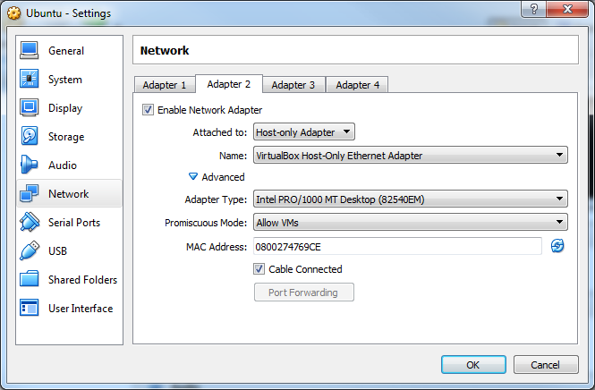
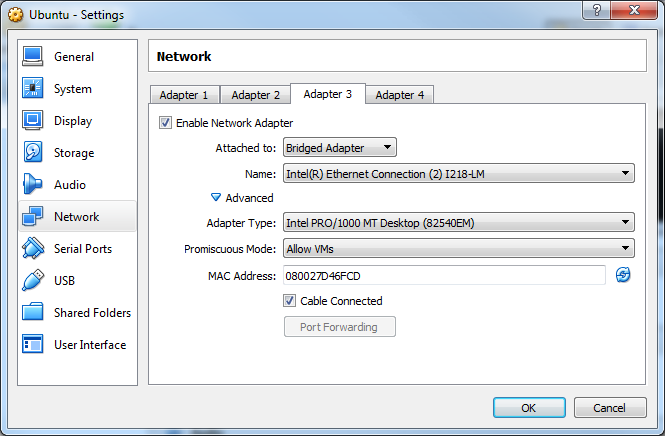

# 1.2 Ubuntu on [Oracle VM VirtualBox](https://www.virtualbox.org/)
* Follow [this tutorial](https://linus.nci.nih.gov/bdge/installUbuntu.html) to download Oracle VM VirtualBox and create a new VM.

## Setting up the Network
In Oracle VirtualBox, make sure the Ubuntu VM is powered off. Then open the settings for the Ubuntu VM. In the Network tab, add two new network adapters:
 * Host-only Adapter 
  
 * Network Bridge 
  
In both set the Promiscuous mode to `allow VMs` and set the `Cable Connected` tag.

In Ubuntu type `$ ifconfig` to check the network configuration and to verify your Ethernet connection to the Windows OS.
The IP address (`enp0s8`) of the Ubuntu system will be used by [`rosbridge_suite`](http://wiki.ros.org/rosbridge_suite?distro=kinetic) and [RosBridgeClient](https://github.com/siemens/ros-sharp/tree/master/RosBridgeClient) as mentioned later in [tutorial 2.1](User_App_ROS_TransferURDFFromROS) tutorial.

These settings are needed so that the [RosBridgeClient](https://github.com/siemens/ros-sharp/tree/master/RosBridgeClient) running in Windows, and the [ROSBridge Server](http://wiki.ros.org/rosbridge_server?distro=kinetic) running on Ubuntu can communicate.

##### Next tutorial: [1.3 ROS on Ubuntu](User_Inst_ROSOnUbuntu)

----
© Siemens AG, 2017-2018
Author: Verena Röhrl
(verena.roehrl@siemens.com)
