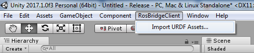
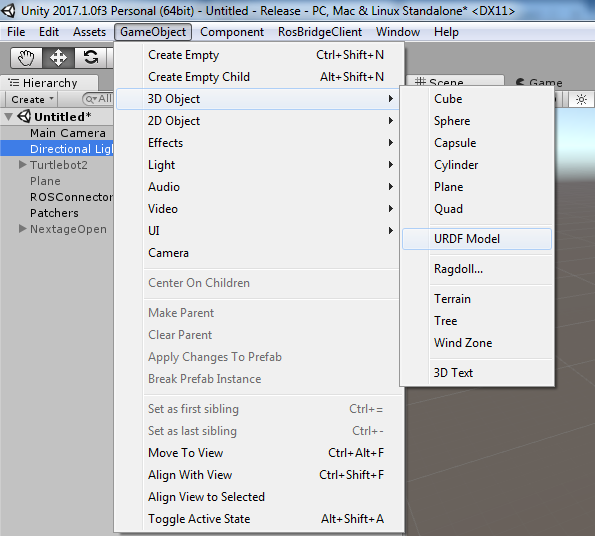
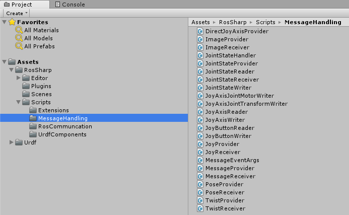

# 1.1  Unity on Windows
## Installing [Unity](https://unity3d.com/)
 * [Download](https://store.unity.com/) and install Unity

## Setting up Unity
* Start Unity and follow on screen instructions to sign in/create an account
* Create a new project
* Copy the [RosSharp folder](https://github.com/siemens/ros-sharp/tree/master/Unity3D/Assets/RosSharp) from the latest commit of our [repository](https://github.com/siemens/ros-sharp) into the Assets folder of your Unity project.

**Note:** Make sure that Unity is using .NET Framework 4.x, since it is required by RosBridgeClient. To do this:
* In the Unity menu, go to `Edit` > `Project Settings` > `Player`.
* In the Inspector pane, look under `Other Settings` > `Configuration`.
* Set `Scripting Runtime Version*` to `.Net 4.x Equivalent`.

Now [RosBridgeClient](https://github.com/siemens/ros-sharp/tree/master/RosBridgeClient) and [UrdfImporter](https://github.com/siemens/ros-sharp/tree/master/UrdfImporter) are included in your [Unity](https://unity3d.com/) project.
Once the plugins have been loaded, the following new menu items will show up:
* `ROSBridgeClient` > `Import URDF Assets...` 
 
* `GameObject` > `3D Object` > `URDF Model...` 
 
Furthermore various scripts and GameObjects are now contained in the `Assets` folder. These accomplish different functionalities explained in [these tutorials](User_App_ROS_ApplicationExamplesWithROSConnection). 
 

##### Next tutorial: [1.2 Ubuntu on Oracle VM](User_Inst_UbuntuOnOracleVM)

----
© Siemens AG, 2017-2018
Author: Verena Röhrl
(verena.roehrl@siemens.com)
